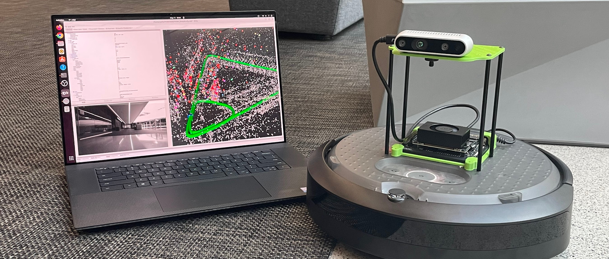

> Attention:
> 
>
> **This tutorial is deprecated.**
>
> Please reference the official [Isaac ROS Docs Site](https://nvidia-isaac-ros.github.io/) to get the latest information and the [quickstart guide](https://nvidia-isaac-ros.github.io/repositories_and_packages/isaac_ros_visual_slam/isaac_ros_visual_slam/index.html#quickstart) on `isaac_ros_visual_slam`.

# Jetson Isaac ROS Visual SLAM Tutorial

Document generation status: [](https://github.com/NVIDIA-AI-IOT/jetson_isaac_ros_visual_slam_tutorial/actions)




# About this repo

This repo is to host a tutorial documentation for running Isaac ROS Visual SLAM on Jetson device.

The auto generated documentation is hosted on the following, using their CI/CD feature to automatically generate/update the HTML documentation site upon new commit:
  - [GitHub Pages site](https://nvidia-ai-iot.github.io/jetson_isaac_ros_visual_slam_tutorial)

## How to use this repo locally

### MkDocs: Initial setup

https://squidfunk.github.io/mkdocs-material/getting-started/

```bash
sudo apt install -y docker.io
sudo docker pull squidfunk/mkdocs-material
```

### Mkdocs: Start development server on http://localhost:8000

```bash
docker run --rm -it -p 8000:8000 -v ${PWD}:/docs squidfunk/mkdocs-material
```

> If you get "docker: Got permission denied while trying to connect to the Docker daemon socket at ..." error, 
> issue `sudo chmod 666 /var/run/docker.sock` to get around with the issue.

## How to also publish on GitHub

(to be documented)