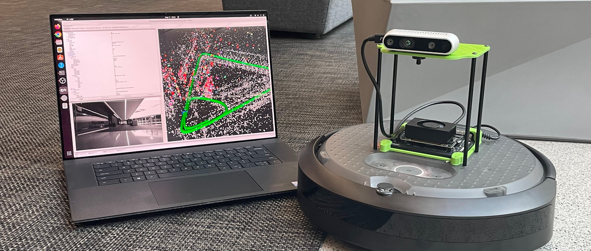

!!! danger "Attention"

    **This tutorial is deprecated.**

    Please reference the official [Isaac ROS Docs Site](https://nvidia-isaac-ros.github.io/) to get the latest information and the [quickstart guide](https://nvidia-isaac-ros.github.io/repositories_and_packages/isaac_ros_visual_slam/isaac_ros_visual_slam/index.html#quickstart) on `isaac_ros_visual_slam`.

# Jetson Isaac ROS Visual SLAM Tutorial

This site provides a tutorial documentation for running [Isaac ROS Visual SLAM](https://github.com/NVIDIA-ISAAC-ROS/isaac_ros_visual_slam) on Jetson device.

## What you will find in this tutorial

This tutorial shows a quick and easy way to run Isaac ROS Visual SLAM with Intel RealSense camera on Jetson Orin Nano Developer Kit.

It comes with a [custom SD card image](./sdcard.md) pre-configured with Isaac ROS software and other tools, enabling the shortest path to evaluate Isaac ROS Visual SLAM on a physical setup.

Jump into the [**Quickstart** page](./quickstart.md) to learn how you can set up your environment to test Isaac ROS Visual SLAM.

### Example video

<iframe width="640" height="360" src="https://www.youtube.com/embed/mNTi1osPSIA" title="YouTube video player" frameborder="0" allow="accelerometer; autoplay; clipboard-write; encrypted-media; gyroscope; picture-in-picture; web-share" allowfullscreen></iframe>

## What is Isaac ROS Visual SLAM

NVIDIA offers Isaac ROS Visual Visual SLAM, best-in-class ROS 2 package for VSLAM (visual simultaneous localization and mapping), on its [:fontawesome-brands-github: GitHub repo](https://github.com/NVIDIA-ISAAC-ROS/isaac_ros_visual_slam).

It takes stereo camera images (optionally with IMU data) and generate odometry output, along with other visualization and diagnostics data.

### Detail specs of Isaac ROS Visual SLAM

See the official repo [:fontawesome-brands-square-github: README.md](https://github.com/NVIDIA-ISAAC-ROS/isaac_ros_visual_slam/blob/main/README.md) ([Accuracy](https://github.com/NVIDIA-ISAAC-ROS/isaac_ros_visual_slam/blob/main/README.md#accuracy), [Performance](https://github.com/NVIDIA-ISAAC-ROS/isaac_ros_visual_slam/blob/main/README.md#performance))

## Change log

| Date        | Description                    |
| ----------- | ------------------------------ |
| 05-15-2023  | Initial version released       |
