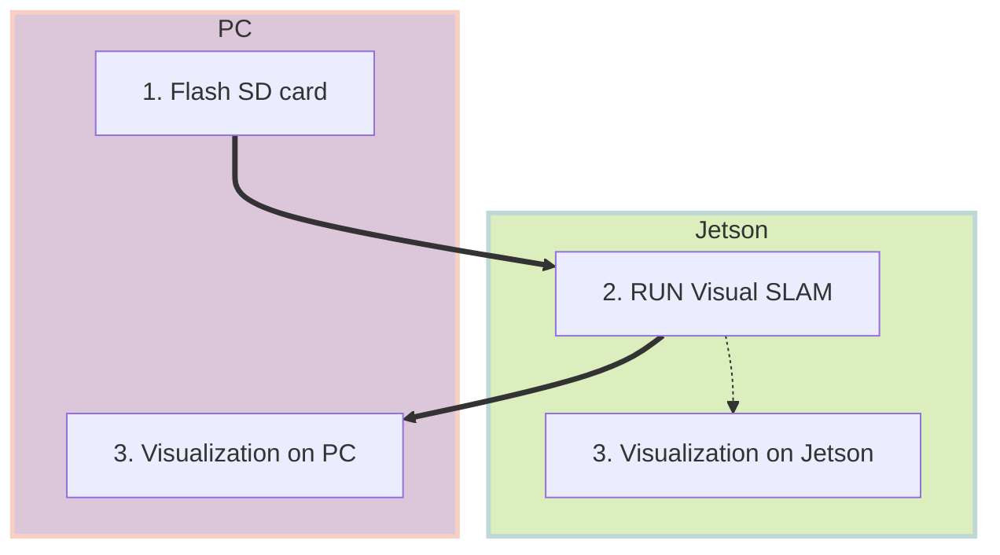
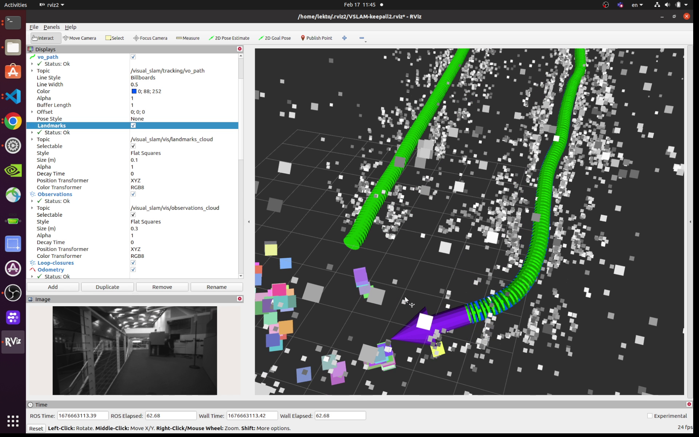

# Quickstart

!!! Abstract "Hardware you need"

    - [Jetson Orin Nano Developer Kit](https://www.nvidia.com/en-us/autonomous-machines/embedded-systems/jetson-orin/)
    - microSD card (>=64GB)
    - Intel RealSense D435i or D455 (See [the list of compatible camera](https://github.com/NVIDIA-ISAAC-ROS/.github/blob/main/profile/realsense-setup.md#camera-compatibility))
    - (Optional) USB-C powerbank ([example1](https://a.co/d/9fS9kQi), [example2](https://a.co/d/dgyngjH))
    - (Optional) USB-C to DC jack cable ([example1](https://a.co/d/dW1u1FS))

## Overview



## 1. Flash SD card

Download the custom SD card image for Jetson Orin Nano on your PC from [SD card image :fontawesome-solid-download:](./sdcard.md) page.

Use [Balena Etcher :fontawesome-solid-arrow-up-right-from-square:](https://www.balena.io/etcher) to flash the downloaded image to microSD card on your PC (Windows, Mac, Linux).

> For the details of SD card flashing and powering on Jetson, refer to the [Jetson Orin Nano Developer Kit Getting Started Guide :fontawesome-solid-arrow-up-right-from-square:](https://developer.nvidia.com/embedded/learn/get-started-jetson-orin-nano-devkit).

## 2. Run

!!! info

    This section is based on the official tutorial, ":fontawesome-brands-square-github: [Tutorial for Visual SLAM using a RealSense camera with integrated IMU](https://github.com/NVIDIA-ISAAC-ROS/isaac_ros_visual_slam/blob/main/docs/tutorial-realsense.md#tutorial-walkthrough---vslam-execution)".

### 2.1 [ :octicons-terminal-16:{ .nvgreen } Terminal 1 ] Start the pre-built Docker container

Make sure you have your RealSense camera attached to Jetson, and then start the Isaac ROS container.

``` { .bash .copy }
isaac_ros_container
```

### 2.2 [ :octicons-terminal-16:{ .nvgreen } Terminal 1 ] Inside the container, (build and) source the workspace:

``` { .bash .copy }
source install/setup.bash
```

> If you have made any changes to ROS 2 packages in your workspace, rebuild the workspace.
> 
> ``` { .bash .copy }
> cd /workspaces/isaac_ros-dev && \
>   colcon build --symlink-install && \
>   source install/setup.bash
> ```

### 2.3 [ :octicons-terminal-16:{ .nvgreen } Terminal 1 ] Run the launch file, which launches the example and wait for 5 seconds:

``` { .bash .copy }
ros2 launch isaac_ros_visual_slam isaac_ros_visual_slam_realsense.launch.py
```

### 2.4 [ :octicons-terminal-16:{ .nvdarkgreen } Terminal 2 ] Attach a second terminal to check the operation.

Attach another terminal to the running container for issuing other ROS 2 commands.

``` { .bash .copy }
isaac_ros_container
```

Inside the container, first check if you can see all the ROS2 topics expected.

``` { .bash .copy }
source install/setup.bash
ros2 topic list
```

### 2.5 [ :octicons-terminal-16:{ .nvdarkgreen } Terminal 2 ]  Record topics into a rosbag file 

When Jetson is running entirely on a SD card (ie. without NVMe SSD), the disk access speed is limited, so use RAM disk. 

``` { .bash .copy }
cd /tmp/ramdisk
```

> Note the RAM disk on the custom SD card is setup to be 2GB. 

Start recording ROS 2 messages into a rosbag file and move around with your camera for up to about 1 minute. 

``` { .bash .copy }
export ROSBAG_NAME=courtyard-d435i
ros2 bag record -o ${ROSBAG_NAME} --include-hidden-topics \
    /camera/infra1/camera_info /camera/infra1/image_rect_raw /camera/infra1/metadata \
    /tf_static /tf \
    /visual_slam/status /visual_slam/tracking/odometry \
    /visual_slam/tracking/vo_pose /visual_slam/tracking/vo_pose_covariance \
    /visual_slam/vis/landmarks_cloud /visual_slam/vis/loop_closure_cloud /visual_slam/vis/observations_cloud 
```

Press ++ctrl+c++ to stop the recording.

> Remember to stop rosbag recording before it runs out of RAM disk space.

### 2.6 [ :octicons-terminal-16:{ .nvdarkgreen } Terminal 2 ] Copy Rosbag file

Copy the rosbag file to other PC, in case you use your PC's ROS 2 environment to examine the recording.

``` { .bash .copy }
export IP_PC=192.168.1.100
scp -r ${ROSBAG_NAME} ${PC_USER}@${IP_PC}:/home/${PC_USER}/Downloads/
```

## 3. Visualization

!!! info

    This section is based on the official tutorial, ":fontawesome-brands-square-github: [Tutorial for Visual SLAM using a RealSense camera with integrated IMU](https://github.com/NVIDIA-ISAAC-ROS/isaac_ros_visual_slam/blob/main/docs/tutorial-realsense.md#offline-visualization)".

If you have a PC with ROS 2 environment already set up, you can use the PC to examine the rosbag file recorded on your Jetson.

Alternatively, if you have a display monitor attached to Jetson, you can perform this visualization on your Jetson.

Either way, the visualization is done **offline**, after the Isaac ROS Visual SLAM execution, using the recorded rosbag file.

### 3.1 [ :simple-windowsterminal:{ .ubuntuorange } Terminal 1 ] Pre-setup

=== ":material-desktop-tower-monitor: PC"

    We assume the ROS 2 Humble environment is set up on your PC.

    Otherwise, follow the [ROS 2 official documentation :fontawesome-solid-arrow-up-right-from-square:](https://docs.ros.org/en/humble/Installation/Ubuntu-Install-Debians.html) to first set up your PC.

    ``` { .bash .copy }
    source /opt/ros/humble/setup.bash
    ```

=== ":material-monitor: Jetson desktop"

    Launch the Isaac ROS container.

    ``` { .bash .copy }
    isaac_ros_container
    ```

=== ":material-remote-desktop: Jetson remote (SSH)"

    > If you are SSH-ing into Jetson from your PC, make sure you enabled X forwarding by adding -X option with SSH command.
    > 
    > ``` { .bash .copy }
    > ssh -X ${USERNAME_ON_JETSON}@${IP_JETSON}
    > ```

    Launch the Isaac ROS container.

    ``` { .bash .copy }
    isaac_ros_container
    ```

### 3.2 [ :simple-windowsterminal:{ .ubuntuorange } Terminal 1 ] Launch Rviz2 with config

``` { .bash .copy }
wget https://github.com/NVIDIA-ISAAC-ROS/isaac_ros_visual_slam/blob/main/isaac_ros_visual_slam/rviz/vslam_keepall.cfg.rviz
rviz2 -d vslam_keepall.cfg.rviz
```

### 3.3 [ :simple-windowsterminal:{ .ubuntupurple } Terminal 2 ] Set up another terminal

Open another terminal.

=== ":material-desktop-tower-monitor: PC"

    Open another temrinal and run:

    ``` { .bash .copy }
    source /opt/ros2/humble/setup.bash
    ```

=== ":material-monitor: Jetson desktop and :material-remote-desktop: remote(SSH)"

    Attach another terminal to the running container.

    ``` { .bash .copy }
    isaac_ros_container
    ```

### 3.4 [ :simple-windowsterminal:{ .ubuntupurple } Terminal 2 ] Playback the recorded rosbag

Play the recorded rosbag file.

``` { .bash .copy }
ros2 bag play ${ROSBAG_NAME} 
```

RViz should start showing visualization like the following.

